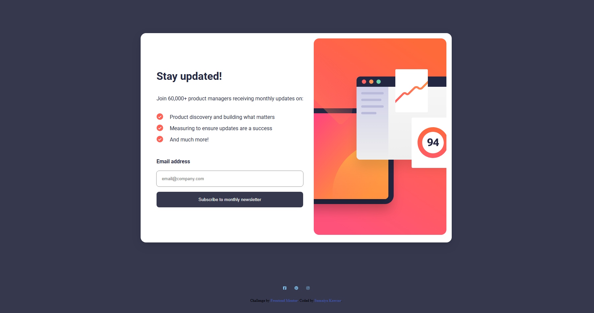

# Frontend Mentor - Newsletter sign-up form with success message

  <h3>
    <a href="https://sumaiyakawsar.github.io/frontend-mentor-challenges-using-react/project16">
      Demo
    </a>
     | 
    <a href="https://github.com/sumaiyakawsar/frontend-mentor-challenges-using-react/tree/main/src/pages/16-newsletter-sign-up">
      Solution
    </a>
     | 
    <a href="https://www.frontendmentor.io/challenges/newsletter-signup-form-with-success-message-3FC1AZbNrv">
      Challenge
    </a>
  </h3>

 

 

## Overview

### The challenge

Your users should be able to:

- Add their email and submit the form
- See a success message with their email after successfully submitting the form
- See form validation messages if:
- - The field is left empty
- - The email address is not formatted correctly
- View the optimal layout for the interface depending on their device's screen size
- See hover and focus states for all interactive elements on the page

### Screenshot

## My process

### Built with

- Semantic HTML5 markup
- SCSS

   
## Author

 