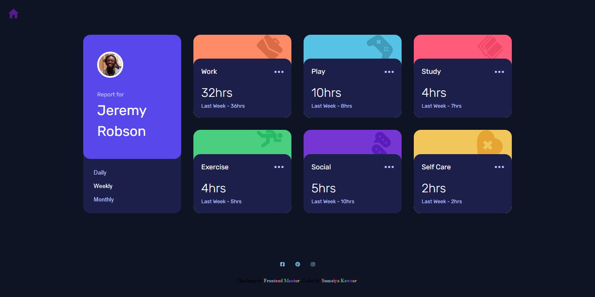

# Frontend Mentor - Newsletter sign-up form with success message

  <h3>
    <a href="https://sumaiyakawsar.github.io/frontend-mentor-challenges-using-react/#/project17">
      Demo
    </a>
     | 
    <a href="https://github.com/sumaiyakawsar/frontend-mentor-challenges-using-react/tree/main/src/pages/17-time-tracking-dashboard">
      Solution
    </a>
     | 
    <a href="https://www.frontendmentor.io/challenges/time-tracking-dashboard-UIQ7167Jw">
      Challenge
    </a>
  </h3>

 

 

## Overview

### The challenge

Your users should be able to:

- [x] Switch between viewing Daily, Weekly, and Monthly stats
- [x] View the optimal layout for the site depending on their device's screen size
- [x] See hover states for all interactive elements on the page

### Screenshot

 

   
## Author

 