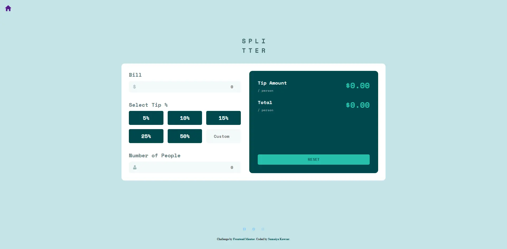

# Frontend Mentor - Tip calculator app solution

  <h3>
    <a href="https://sumaiyakawsar.github.io/frontend-mentor-challenges-using-react/#/project18">
      Demo
    </a>
     | 
    <a href="https://github.com/sumaiyakawsar/frontend-mentor-challenges-using-react/tree/main/src/pages/18-tip-calculator-app">
      Solution
    </a>
     | 
    <a href="https://www.frontendmentor.io/challenges/tip-calculator-app-ugJNGbJUX">
      Challenge
    </a>
  </h3>

 

 

## Overview

### The challenge

Users should be able to:

- [x] View the optimal layout for the app depending on their device's screen size
- [x] See hover states for all interactive elements on the page
- [x] Calculate the correct tip and total cost of the bill per person
 
### Screenshot

 

   
## Author

 