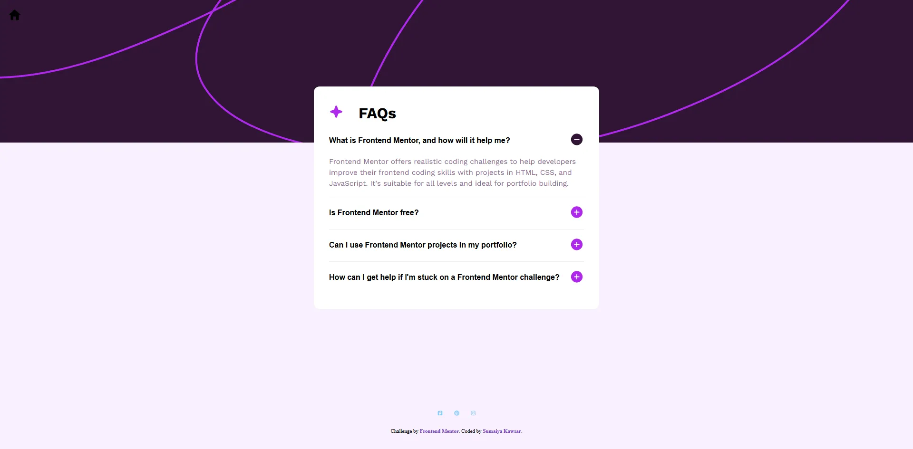

# Frontend Mentor - FAQ accordion

  <h3>
    <a href="https://sumaiyakawsar.github.io/frontend-mentor-challenges-using-react/#/project20">
      Demo
    </a>
     | 
    <a href="https://github.com/sumaiyakawsar/frontend-mentor-challenges-using-react/tree/main/src/pages/20-faq-accordion">
      Solution
    </a>
     | 
    <a href="https://www.frontendmentor.io/challenges/faq-accordion-wyfFdeBwBz">
      Challenge
    </a>
  </h3>

 

 

## Overview

### The challenge

Users should be able to:
 
- [x] Hide/Show the answer to a question when the question is clicked
- [x] Navigate the questions and hide/show answers using keyboard navigation alone
- [x] View the optimal layout for the interface depending on their device's screen size
- [x] See hover and focus states for all interactive elements on the page
  
### Screenshot

 

   
## Author

 