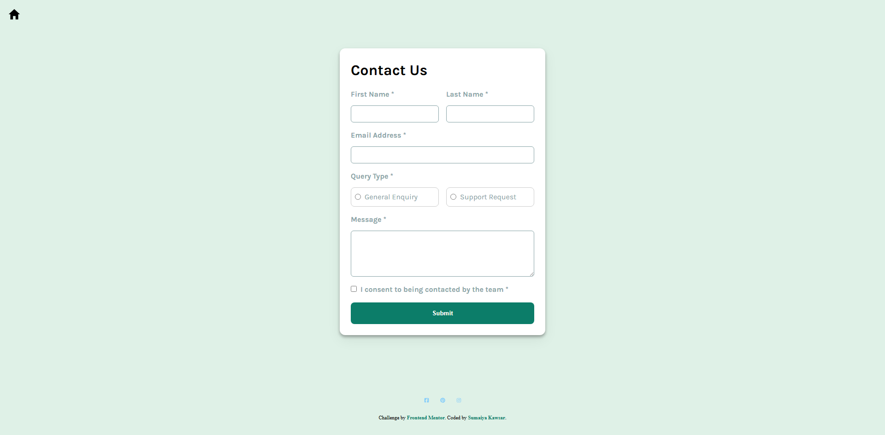

# Frontend Mentor - Contact form solution

  <h3>
    <a href="https://sumaiyakawsar.github.io/frontend-mentor-challenges-using-react/#/project21">
      Demo
    </a>
     | 
    <a href="https://github.com/sumaiyakawsar/frontend-mentor-challenges-using-react/tree/main/src/pages/21-contact-form">
      Solution
    </a>
     | 
    <a href="https://www.frontendmentor.io/challenges/contact-form--G-hYlqKJj">
      Challenge
    </a>
  </h3>

 

 

## Overview

### The challenge

Users should be able to:

- [x] Complete the form and see a success toast message upon successful submission
- [x] Receive form validation messages if:
- [x] A required field has been missed
- [x] The email address is not formatted correctly
- [x] Complete the form only using their keyboard
- [x] Have inputs, error messages, and the success message announced on their screen reader
- [x] View the optimal layout for the interface depending on their device's screen size
- [x] See hover and focus states for all interactive elements on the page
  
### Screenshot

 

   
## Author

 