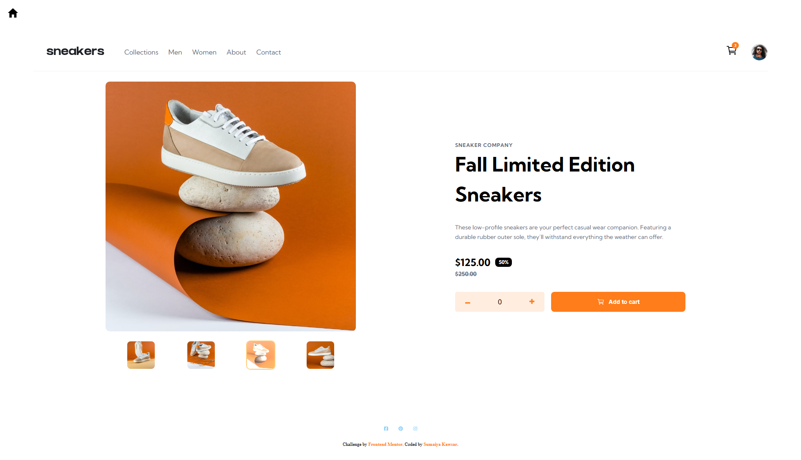

# Frontend Mentor - E-commerce product page

  <h3>
    <a href="https://sumaiyakawsar.github.io/frontend-mentor-challenges-using-react/#/project22">
      Demo
    </a>
     | 
    <a href="https://github.com/sumaiyakawsar/frontend-mentor-challenges-using-react/tree/main/src/pages/23-ecommerce-product-page">
      Solution
    </a>
     | 
    <a href="https://www.frontendmentor.io/challenges/ecommerce-product-page-UPsZ9MJp6">
      Challenge
    </a>
  </h3>

 

 

## Overview

### The challenge

Users should be able to:

- [x] Open a lightbox gallery by clicking on the large product image
- [x] Switch the large product image by clicking on the small thumbnail images
- [x] Add items to the cart
- [x] View the cart and remove items from it
- [x] View the optimal layout for the site depending on their device's screen size
- [x] See hover states for all interactive elements on the page

### Screenshot

 ### Built with
- Mobile-first workflow
- [React](https://reactjs.org/) 

   
## Author

 