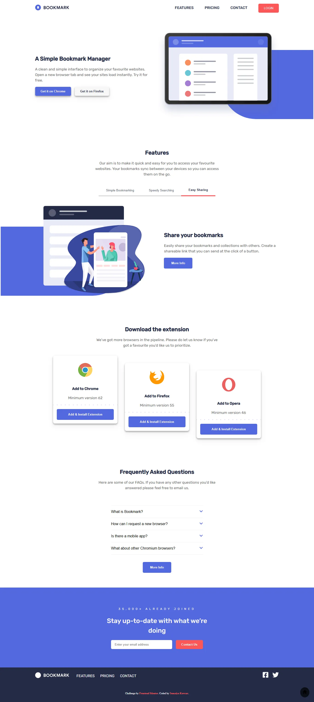

# Frontend Mentor - Bookmark landing page

  <h3>
    <a href="https://sumaiyakawsar.github.io/frontend-mentor-challenges-using-react/#/project26">
      Demo
    </a>
     | 
    <a href="https://github.com/sumaiyakawsar/frontend-mentor-challenges-using-react/tree/main/src/pages/26-bookmark-landing-page">
      Solution
    </a>
     | 
    <a href="https://www.frontendmentor.io/challenges/bookmark-landing-page-5d0b588a9edda32581d29158">
      Challenge
    </a>
  </h3>

 

## Overview

### The challenge

Users should be able to:

- [x] View the optimal layout for the interface depending on their device's screen size
- [x] See hover and focus states for all interactive elements on the page
- [x] Receive an error message when the newsletter form is submitted if:
- The input field is empty
- The email address is not formatted correctly

### Screenshot

## Author

 