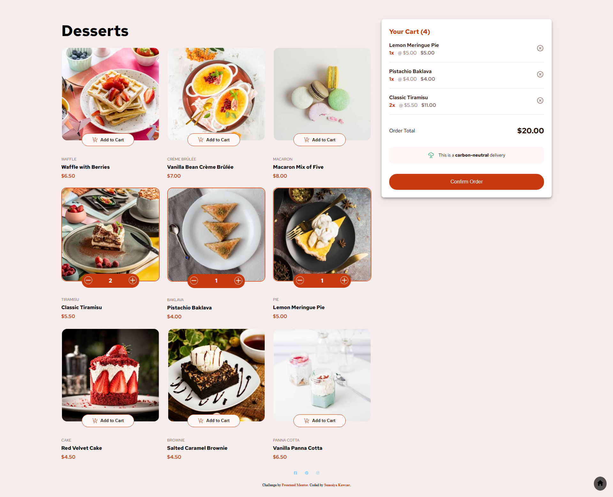

# Frontend Mentor - Product list with cart

  <h3>
    <a href="https://sumaiyakawsar.github.io/frontend-mentor-challenges-using-react/#/project28">
      Demo
    </a>
     | 
    <a href="https://github.com/sumaiyakawsar/frontend-mentor-challenges-using-react/tree/main/src/pages/28-product-list-with-cart">
      Solution
    </a>
     | 
    <a href="https://www.frontendmentor.io/challenges/product-list-with-cart-5MmqLVAp_d">
      Challenge
    </a>
  </h3>

 

 

## Overview

### The challenge

Users should be able to:
- [x] Add items to the cart and remove them
- [x] Increase/decrease the number of items in the cart
- [x] See an order confirmation modal when they click "Confirm Order"
- [x] Reset their selections when they click "Start New Order"
- [x] View the optimal layout for the interface depending on their device's screen size
- [x] See hover and focus states for all interactive elements on the page

### Screenshot

 ### Built with
- Mobile-first workflow
- [React](https://reactjs.org/) 

   
## Author

 