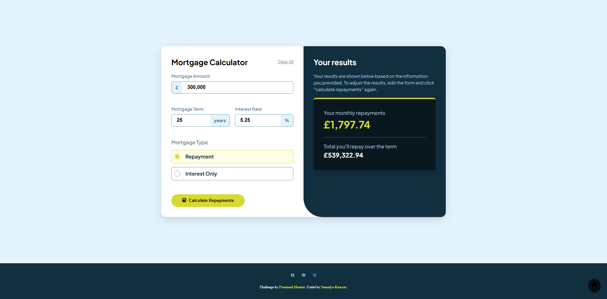

# Frontend Mentor - Mortgage repayment calculator solution

  <h3>
    <a href="https://sumaiyakawsar.github.io/frontend-mentor-challenges-using-react/#/project29">
      Demo
    </a>
     | 
    <a href="https://github.com/sumaiyakawsar/frontend-mentor-challenges-using-react/tree/main/src/pages/29-mortgage-repayment-calculator">
      Solution
    </a>
     | 
    <a href="https://www.frontendmentor.io/challenges/mortgage-repayment-calculator-Galx1LXK73">
      Challenge
    </a>
  </h3>

 

 

## Overview

### The challenge

Users should be able to:
 
- [x] Input mortgage information and see monthly repayment and total repayment amounts after submitting the form
- [x] See form validation messages if any field is incomplete
- [x] Complete the form only using their keyboard
- [x] View the optimal layout for the interface depending on their device's screen size
- [x] See hover and focus states for all interactive elements on the page
### Screenshot

 

   
## Author

 