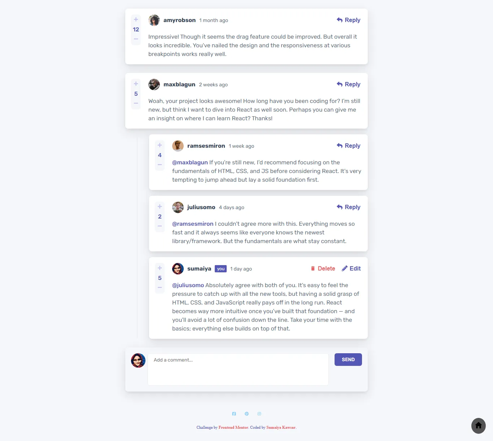

# Frontend Mentor - Interactive comments section solution

  <h3>
    <a href="https://sumaiyakawsar.github.io/frontend-mentor-challenges-using-react/#/project30">
      Demo
    </a>
     | 
    <a href="https://github.com/sumaiyakawsar/frontend-mentor-challenges-using-react/tree/main/src/pages/30-interactive-comments">
      Solution
    </a>
     | 
    <a href="https://www.frontendmentor.io/challenges/interactive-comments-section-iG1RugEG9">
      Challenge
    </a>
  </h3>

 

 

## Overview

### The challenge

Users should be able to:

- [x] View the optimal layout for the app depending on their device's screen size
- [x] See hover states for all interactive elements on the page
- [x] Create, Read, Update, and Delete comments and replies
- [x] Upvote and downvote comments
- [x] **Bonus**: If you're building a purely front-end project, use `localStorage` to save the current state in the browser that persists when the browser is refreshed.
- [x] **Bonus**: Instead of using the `createdAt` strings from the `data.json` file, try using timestamps and dynamically track the time since the comment or reply was posted.

### Screenshot

 

   
## Author

 