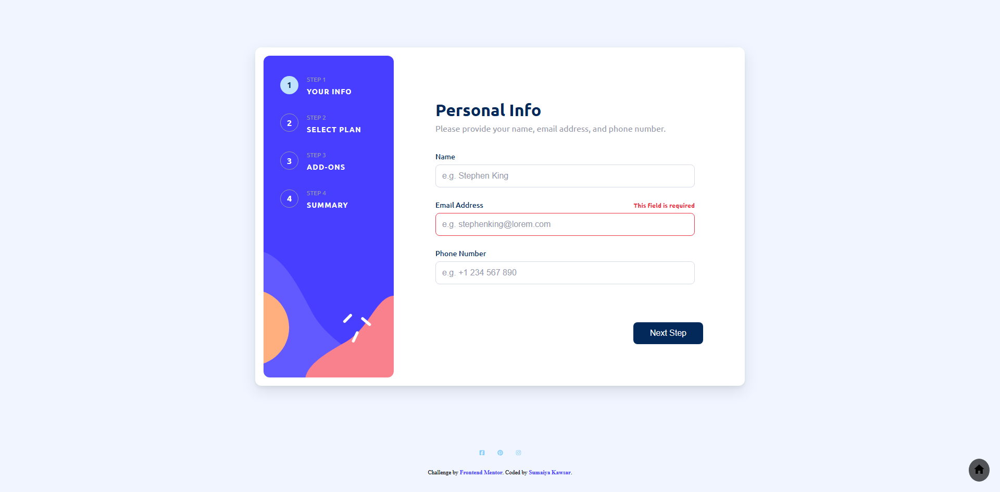

# Frontend Mentor - Multi-step form solution

  <h3>
    <a href="https://sumaiyakawsar.github.io/frontend-mentor-challenges-using-react/#/project31">
      Demo
    </a>
     | 
    <a href="https://github.com/sumaiyakawsar/frontend-mentor-challenges-using-react/tree/main/src/pages/31-multi-step-form">
      Solution
    </a>
     | 
    <a href="https://www.frontendmentor.io/challenges/multistep-form-YVAnSdqQBJ">
      Challenge
    </a>
  </h3>

 

 

## Overview

### The challenge

Users should be able to:

- [x] Complete each step of the sequence
- [x] Go back to a previous step to update their selections
- [x] See a summary of their selections on the final step and confirm their order
- [x] View the optimal layout for the interface depending on their device's screen size
- [x] See hover and focus states for all interactive elements on the page
- [x] Receive form validation messages if:
  - [x] A field has been missed
  - [x] The email address is not formatted correctly
  - [x] A step is submitted, but no selection has been made

### Screenshot

 

   
## Author

 