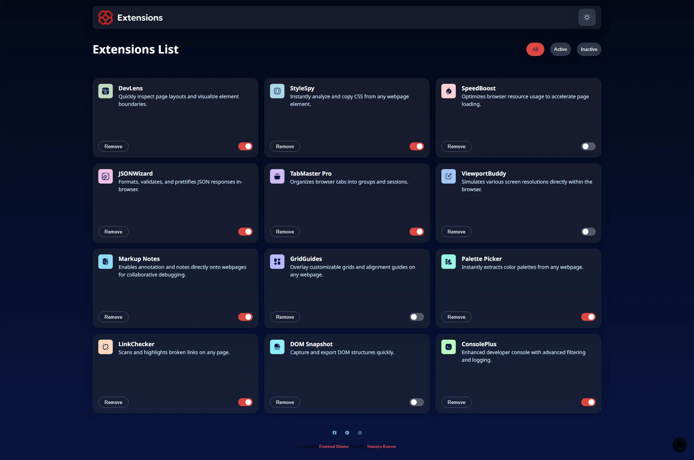

# Frontend Mentor - Browser extensions manager UI solution

  <h3>
    <a href="https://sumaiyakawsar.github.io/frontend-mentor-challenges-using-react/#/project32">
      Demo
    </a>
     | 
    <a href="https://github.com/sumaiyakawsar/frontend-mentor-challenges-using-react/tree/main/src/pages/32-browser-extensions-manager-ui">
      Solution
    </a>
     | 
    <a href="https://www.frontendmentor.io/challenges/browser-extension-manager-ui-yNZnOfsMAp">
      Challenge
    </a>
  </h3>

 

 

## Overview

### The challenge

Users should be able to:

- [x] Toggle extensions between active and inactive states
- [x] Filter active and inactive extensions
- [x] Remove extensions from the list
- [x] Select their color theme
- [x] View the optimal layout for the interface depending on their device's screen size
- [x] See hover and focus states for all interactive elements on the page

Bonus Features
- [x] Toast when deleted
- [x] Confirmation Dialog
- [x] Animations

### Screenshot

 

   
## Author

 