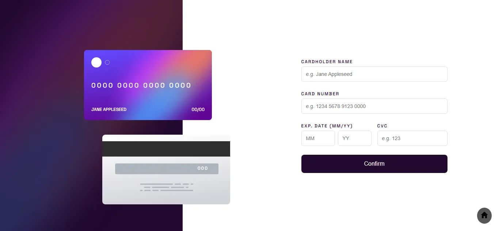

# Frontend Mentor - Interactive card details form

  <h3>
    <a href="https://sumaiyakawsar.github.io/frontend-mentor-challenges-using-react/#/project33">
      Demo
    </a>
     | 
    <a href="https://github.com/sumaiyakawsar/frontend-mentor-challenges-using-react/tree/main/src/pages/33-interactive-card-details-form">
      Solution
    </a>
     | 
    <a href="https://www.frontendmentor.io/challenges/interactive-card-details-form-XpS8cKZDWw">
      Challenge
    </a>
  </h3>

 

 

## Overview

### The challenge

Users should be able to:

- [x] Fill in the form and see the card details update in real-time
- [x]  Receive error messages when the form is submitted if:
  - [x] Any input field is empty
  - [x] The card number, expiry date, or CVC fields are in the wrong format
- [x] View the optimal layout depending on their device's screen size
- [x] See hover, active, and focus states for interactive elements on the page
 

### Screenshot

 

   
## Author

 