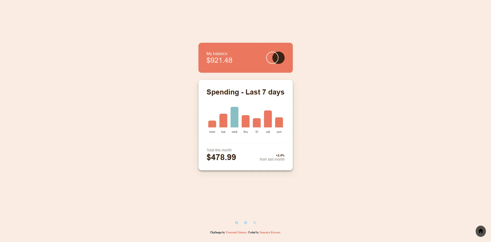

# Frontend Mentor - Expenses chart component solution

  <h3>
    <a href="https://sumaiyakawsar.github.io/frontend-mentor-challenges-using-react/#/project34">
      Demo
    </a>
     | 
    <a href="https://github.com/sumaiyakawsar/frontend-mentor-challenges-using-react/tree/main/src/pages/34-expenses-chart-component">
      Solution
    </a>
     | 
    <a href="https://www.frontendmentor.io/challenges/expenses-chart-component-e7yJBUdjwt">
      Challenge
    </a>
  </h3>

 

 

## Overview

### The challenge

Users should be able to:

- [x] View the bar chart and hover over the individual bars to see the correct amounts for each day
- [x] See the current day’s bar highlighted in a different colour to the other bars
- [x] View the optimal layout for the content depending on their device’s screen size
- [x] See hover states for all interactive elements on the page
- [x] **Bonus**: Use the JSON data file provided to dynamically size the bars on the chart
### Screenshot

 

   
## Author

 