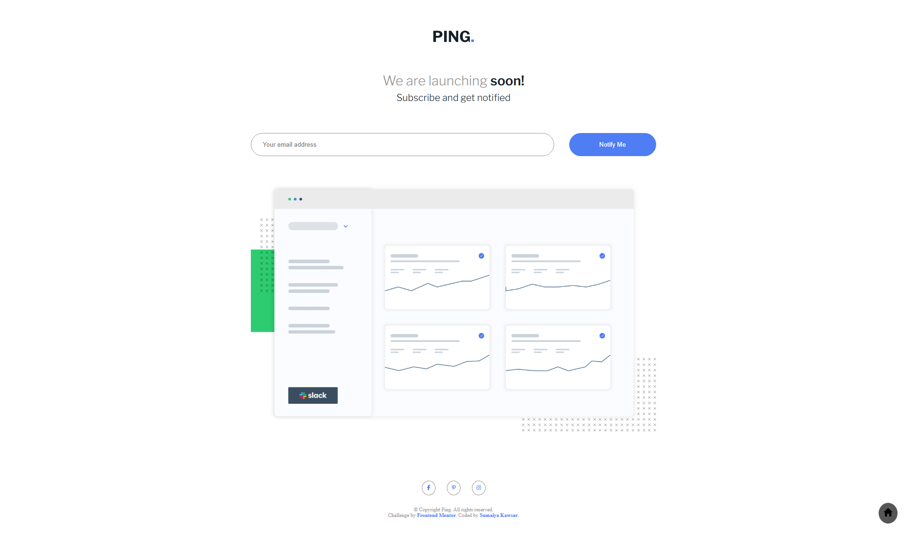

# Frontend Mentor - Ping coming soon page solution

  <h3>
    <a href="https://sumaiyakawsar.github.io/frontend-mentor-challenges-using-react/#/project35">
      Demo
    </a>
     | 
    <a href="https://github.com/sumaiyakawsar/frontend-mentor-challenges-using-react/tree/main/src/pages/35-ping-coming-soon-page">
      Solution
    </a>
     | 
    <a href="https://www.frontendmentor.io/challenges/ping-single-column-coming-soon-page-5cadd051fec04111f7b848da">
      Challenge
    </a>
  </h3>

 

 

## Overview

### The challenge

Users should be able to:

 
- [x] View the optimal layout for the site depending on their device's screen size
- [x] See hover states for all interactive elements on the page
- [x] Submit their email address using an `input` field
- [x] Receive an error message when the `form` is submitted if:
	- [x] The `input` field is empty. The message for this error should say *"Whoops! It looks like you forgot to add your email"*
	- [x] The email address is not formatted correctly (i.e. a correct email address should have this structure: `name@host.tld`). The message for this error should say *"Please provide a valid email address"*

  
### Screenshot

 

   
## Author

 