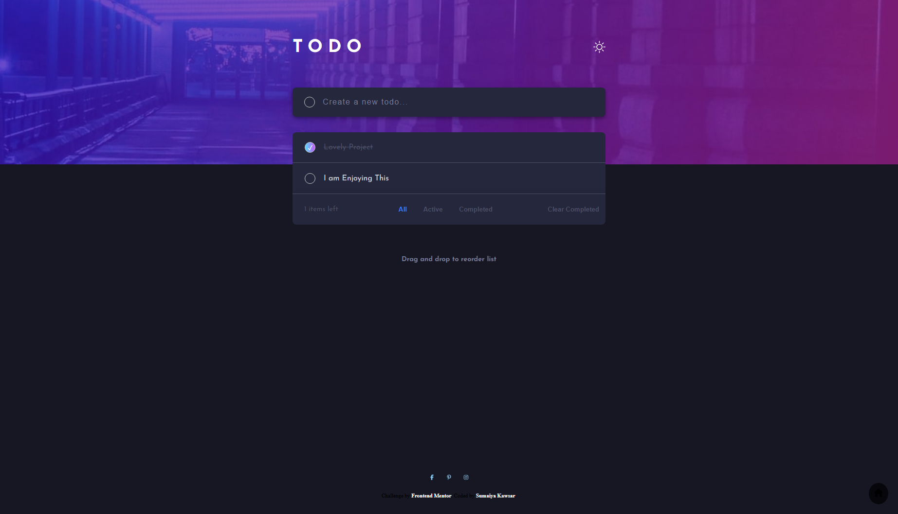

# Frontend Mentor - Todo app solution

  <h3>
    <a href="https://sumaiyakawsar.github.io/frontend-mentor-challenges-using-react/#/project36">
      Demo
    </a>
     | 
    <a href="https://github.com/sumaiyakawsar/frontend-mentor-challenges-using-react/tree/main/src/pages/36-todo-app">
      Solution
    </a>
     | 
    <a href="https://www.frontendmentor.io/challenges/todo-app-Su1_KokOW">
      Challenge
    </a>
  </h3>

 

 

## Overview

### The challenge

Users should be able to:
 
- [x] View the optimal layout for the app depending on their device's screen size
- [x] See hover states for all interactive elements on the page
- [x] Add new todos to the list
- [x] Mark todos as complete
- [x] Delete todos from the list
- [x] Filter by all/active/complete todos
- [x] Clear all completed todos
- [x] Toggle light and dark mode
- [x] **Bonus**: Drag and drop to reorder items on the list 

### Screenshot

 

   
## Author

 