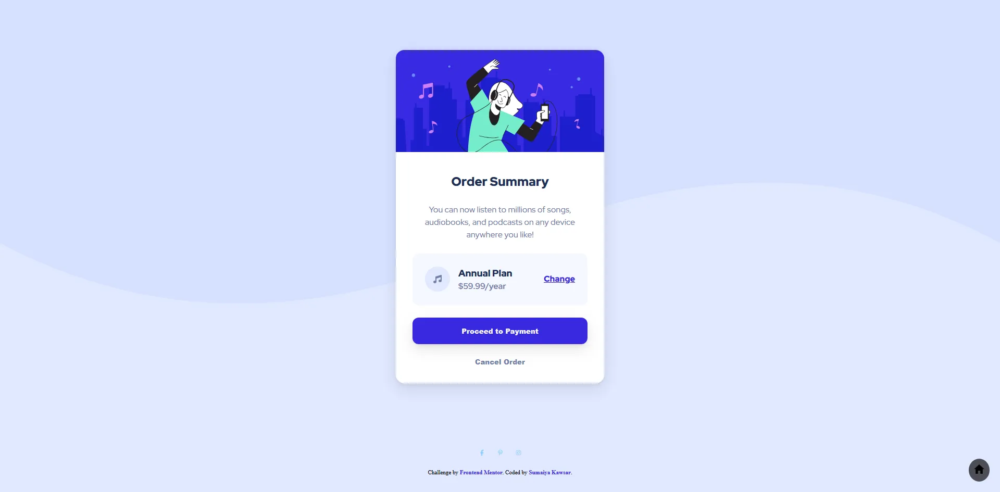

# Frontend Mentor - Order summary card solution

  <h3>
    <a href="https://sumaiyakawsar.github.io/frontend-mentor-challenges-using-react/#/project38">
      Demo
    </a>
     | 
    <a href="https://github.com/sumaiyakawsar/frontend-mentor-challenges-using-react/tree/main/src/pages/38-order-summary-component">
      Solution
    </a>
     | 
    <a href="https://www.frontendmentor.io/challenges/order-summary-component-QlPmajDUj">
      Challenge
    </a>
  </h3>

 

 

## Overview

 

### The challenge

Your users should be able to:

- [x] See hover states for interactive elements

### Screenshot

 

## Author

 