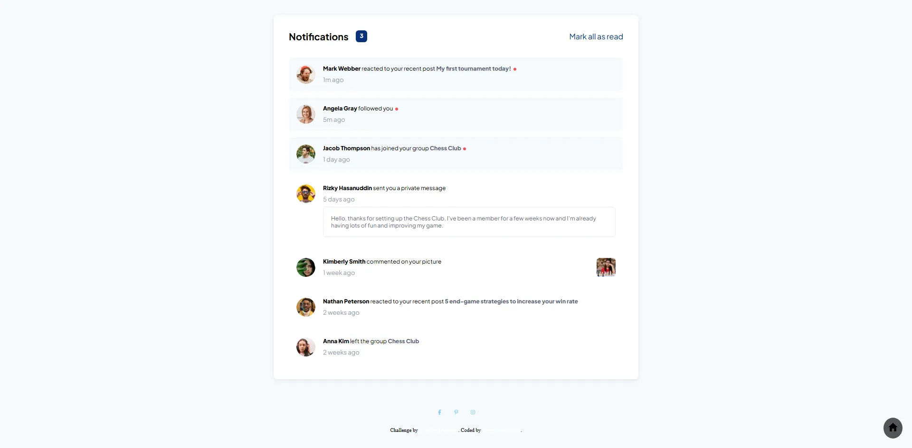

# Frontend Mentor - Notifications page solution

  <h3>
    <a href="https://sumaiyakawsar.github.io/frontend-mentor-challenges-using-react/#/project46">
      Demo
    </a>
     | 
    <a href="https://github.com/sumaiyakawsar/frontend-mentor-challenges-using-react/tree/main/src/pages/46-notifications-page">
      Solution
    </a>
     | 
    <a href="https://www.frontendmentor.io/challenges/notifications-page-DqK5QAmKbC">
      Challenge
    </a>
  </h3>

 

 

## Overview
  

### The challenge

Your users should be able to:
 
- [x] Distinguish between "unread" and "read" notifications
- [x] Select "Mark all as read" to toggle the visual state of the unread notifications and set the number of unread messages to zero
- [x] View the optimal layout for the interface depending on their device's screen size
- [x] See hover and focus states for all interactive elements on the page

### Screenshot

## Author

 