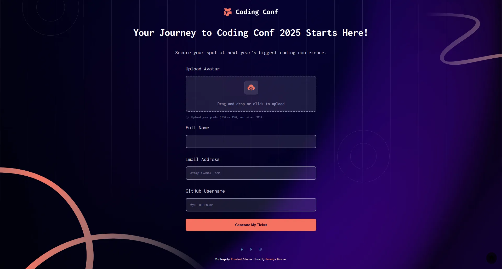

# Frontend Mentor - Conference ticket generator solution

  <h3>
    <a href="https://sumaiyakawsar.github.io/frontend-mentor-challenges-using-react/#/project47">
      Demo
    </a>
     | 
    <a href="https://github.com/sumaiyakawsar/frontend-mentor-challenges-using-react/tree/main/src/pages/47-conference-ticket-generator">
      Solution
    </a>
     | 
    <a href="https://www.frontendmentor.io/challenges/conference-ticket-generator-oq5gFIU12w">
      Challenge
    </a>
  </h3>

 

 

## Overview
  

### The challenge

Your users should be able to:
 
- [x] Complete the form with their details
- [x] Receive form validation messages if:
  - [x] Any field is missed
  - [x] The email address is not formatted correctly
  - [x] The avatar upload is too big or the wrong image format
- [x] Complete the form only using their keyboard
- [x] Have inputs, form field hints, and error messages announced on their screen reader
- [x] See the generated conference ticket when they successfully submit the form
- [x] View the optimal layout for the interface depending on their device's screen size
- [x] See hover and focus states for all interactive elements on the page

### Screenshot

## Author

 