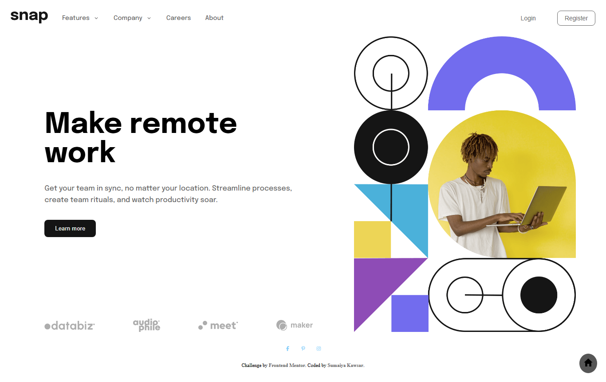

# Frontend Mentor - Intro section with dropdown navigation solution

  <h3>
    <a href="https://sumaiyakawsar.github.io/frontend-mentor-challenges-using-react/#/project53">
      Demo
    </a>
     | 
    <a href="https://github.com/sumaiyakawsar/frontend-mentor-challenges-using-react/tree/main/src/pages/53-intro-with-dropdown-nav">
      Solution
    </a>
     | 
    <a href="https://www.frontendmentor.io/challenges/intro-section-with-dropdown-navigation-ryaPetHE5">
      Challenge
    </a>
  </h3>

 

## Overview
  

### The challenge

Users should be able to:
 
- [x] View the relevant dropdown menus on desktop and mobile when interacting with the navigation links
- [x] View the optimal layout for the content depending on their device's screen size
- [x] See hover states for all interactive elements on the page

### Screenshot

## Author

 