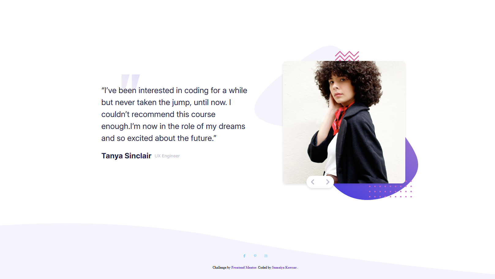

# Frontend Mentor - Coding bootcamp testimonials slider solution

  <h3>
    <a href="https://sumaiyakawsar.github.io/frontend-mentor-challenges-using-react/#/project58">
      Demo
    </a>
     | 
    <a href="https://github.com/sumaiyakawsar/frontend-mentor-challenges-using-react/tree/main/src/pages/58-coding-bootcamp-testimonials">
      Solution
    </a>
     | 
    <a href="https://www.frontendmentor.io/challenges/coding-bootcamp-testimonials-slider-4FNyLA8JL">
      Challenge
    </a>
  </h3>

 

## Overview
  

### The challenge

Users should be able to:

- [x] View the optimal layout for the interface depending on their device's screen size 
- [x] Navigate the slider using either their mouse/trackpad or keyboard

### Screenshot

## Author

 