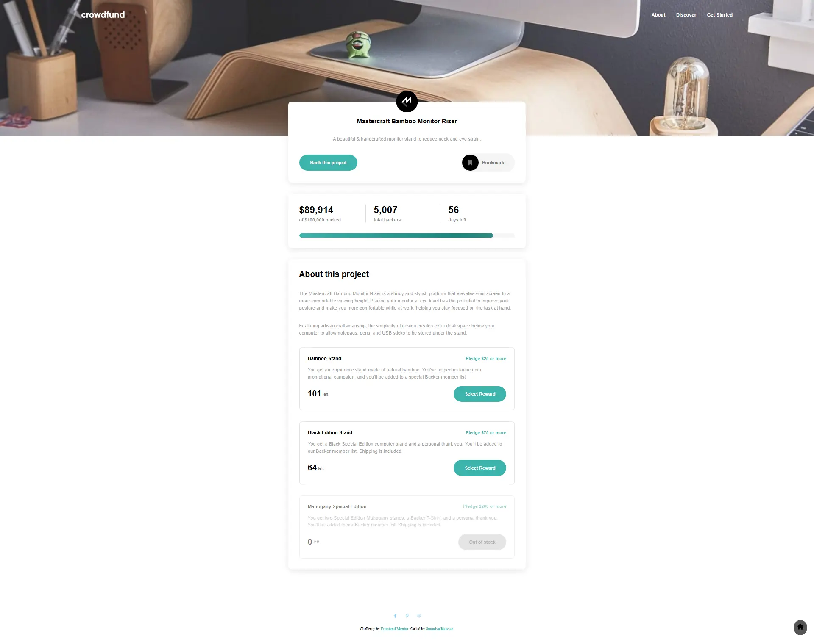

# Frontend Mentor - Crowdfunding product page solution

  <h3>
    <a href="https://sumaiyakawsar.github.io/frontend-mentor-challenges-using-react/#/project60">
      Demo
    </a>
     | 
    <a href="https://github.com/sumaiyakawsar/frontend-mentor-challenges-using-react/tree/main/src/pages/60-crowdfunding-product-page">
      Solution
    </a>
     | 
    <a href="https://www.frontendmentor.io/challenges/crowdfunding-product-page-7uvcZe7ZR">
      Challenge
    </a>
  </h3>

 

## Overview
  

### The challenge

Users should be able to:

- [x] View the optimal layout depending on their device's screen size
- [x] See hover states for interactive elements
- [x] Make a selection of which pledge to make
- [x] See an updated progress bar and total money raised based on their pledge total after confirming a pledge
- [x] See the number of total backers increment by one after confirming a pledge
- [x] Toggle whether or not the product is bookmarked

### Screenshot

## Author

 