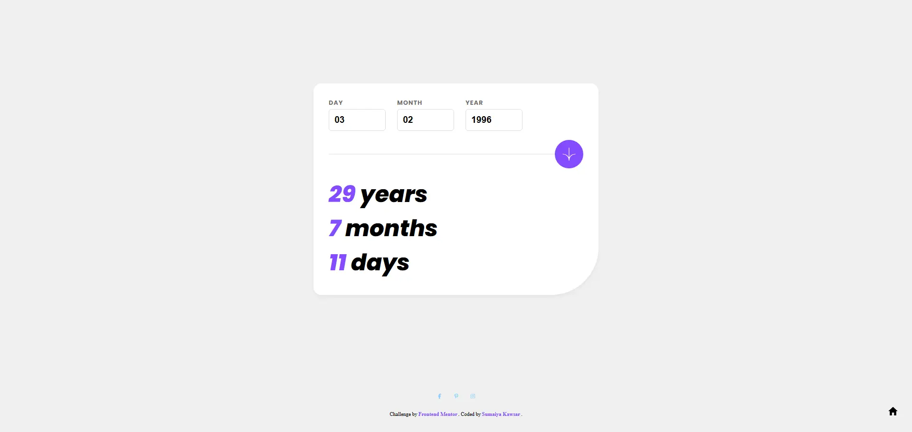

# Frontend Mentor - Age calculator app solution

  <h3>
    <a href="https://sumaiyakawsar.github.io/frontend-mentor-challenges-using-react/#/project61">
      Demo
    </a>
     | 
    <a href="https://github.com/sumaiyakawsar/frontend-mentor-challenges-using-react/tree/main/src/pages/61-age-calculator">
      Solution
    </a>
     | 
    <a href="https://www.frontendmentor.io/challenges/age-calculator-app-dF9DFFpj-Q">
      Challenge
    </a>
  </h3>

 

## Overview
  

### The challenge

Users should be able to:

- [x] View an age in years, months, and days after submitting a valid date through the form
- [x] Receive validation errors if:
  - [x] Any field is empty when the form is submitted
  - [x] The day number is not between 1-31
  - [x] The month number is not between 1-12
  - [x] The year is in the future
  - [x] The date is invalid e.g. 31/04/1991 (there are 30 days in April)
- [x] View the optimal layout for the interface depending on their device's screen size
- [x] See hover and focus states for all interactive elements on the page
- [x] **Bonus**: See the age numbers animate to their final number when the form is submitted

### Screenshot

## Author

 