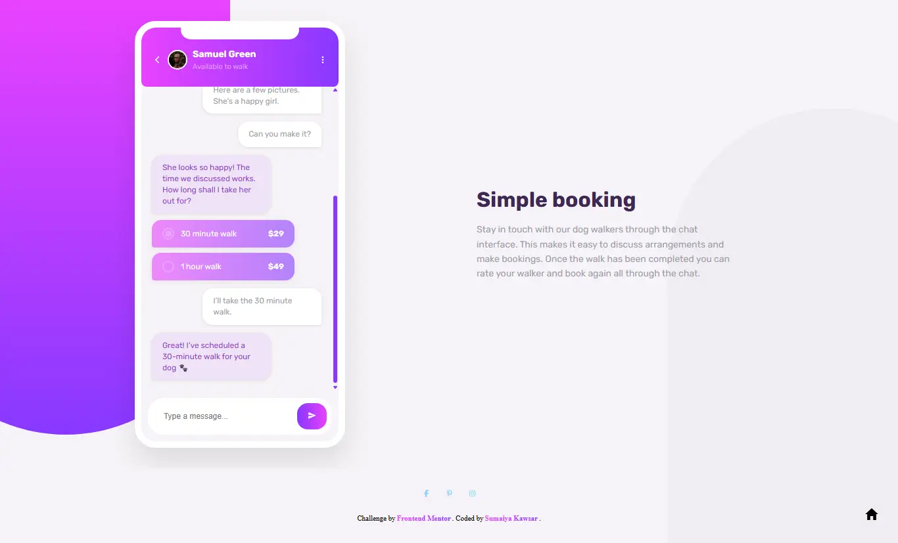

# Frontend Mentor - Chat app CSS illustration solution

  <h3>
    <a href="https://sumaiyakawsar.github.io/frontend-mentor-challenges-using-react/#/project65">
      Demo
    </a>
     | 
    <a href="https://github.com/sumaiyakawsar/frontend-mentor-challenges-using-react/tree/main/src/pages/65-chat-app">
      Solution
    </a>
     | 
    <a href="https://www.frontendmentor.io/challenges/chat-app-css-illustration-O5auMkFqY">
      Challenge
    </a>
  </h3>

 

 

## Overview
  

### The challenge

Your users should be able to:

 - [x] View the optimal layout for the component depending on their device's screen size
- **Bonus**: See the chat interface animate on the initial load

### Screenshot

## Author

 