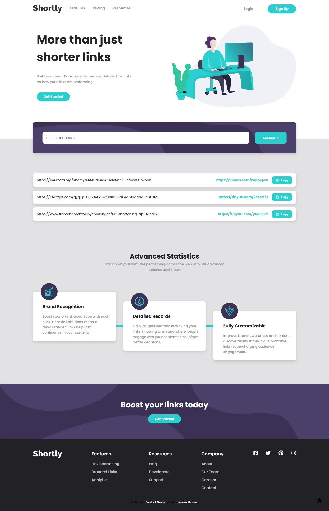

# Frontend Mentor -  Shortly URL shortening API Challenge solution

  <h3>
    <a href="https://sumaiyakawsar.github.io/frontend-mentor-challenges-using-react/#/project66">
      Demo
    </a>
     | 
    <a href="https://github.com/sumaiyakawsar/frontend-mentor-challenges-using-react/tree/main/src/pages/66-url-shortening">
      Solution
    </a>
     | 
    <a href="https://www.frontendmentor.io/challenges/url-shortening-api-landing-page-2ce3ob-G">
      Challenge
    </a>
  </h3>

 

## Overview
  

### The challenge

Users should be able to:
 
- [x] View the optimal layout for the site depending on their device's screen size
- [x] Shorten any valid URL
- [x] See a list of their shortened links, even after refreshing the browser
- [x] Copy the shortened link to their clipboard in a single click
- [x] Receive an error message when the `form` is submitted if:
  - [x] The `input` field is empty

### Screenshot

## Author

 