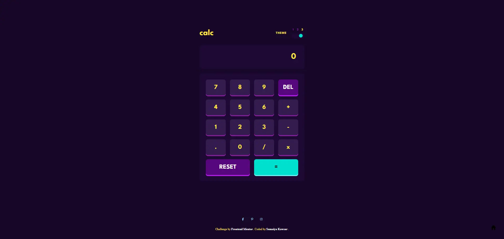

# Frontend Mentor -  Calculator App solution

  <h3>
    <a href="https://sumaiyakawsar.github.io/frontend-mentor-challenges-using-react/#/project68">
      Demo
    </a>
     | 
    <a href="https://github.com/sumaiyakawsar/frontend-mentor-challenges-using-react/tree/main/src/pages/68-calculator-app">
      Solution
    </a>
     | 
    <a href="https://www.frontendmentor.io/challenges/calculator-app-9lteq5N29">
      Challenge
    </a>
  </h3>

 

## Overview
  

### The challenge

Users should be able to:

- [x] See the size of the elements adjust based on their device's screen size
- [x] Perform mathmatical operations like addition, subtraction, multiplication, and division
- [x] Adjust the color theme based on their preference
- [x] **Bonus**: Have their initial theme preference checked using `prefers-color-scheme` and have any additional changes saved in the browser

 
### Screenshot

## Author

 