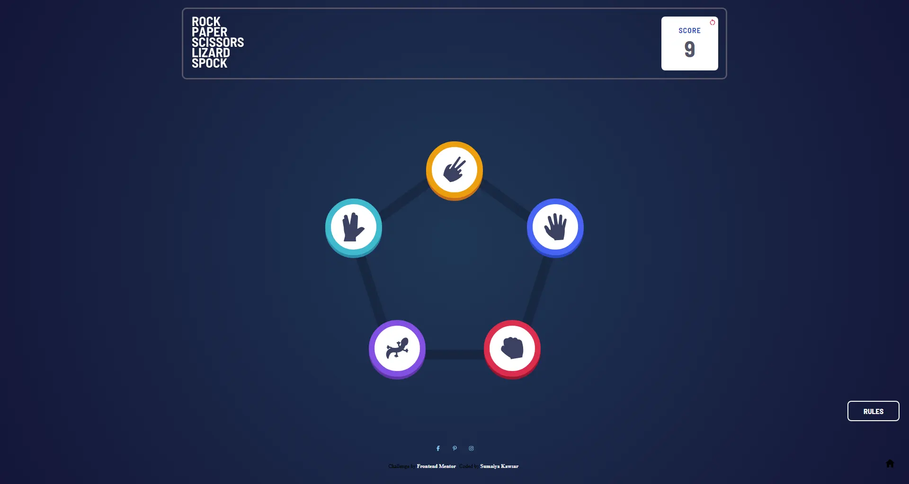

# Frontend Mentor -  Rock, Paper, Scissors, Lizard, Spock solution

  <h3>
    <a href="https://sumaiyakawsar.github.io/frontend-mentor-challenges-using-react/#/project69">
      Demo
    </a>
     | 
    <a href="https://github.com/sumaiyakawsar/frontend-mentor-challenges-using-react/tree/main/src/pages/69-rock-paper-scissors">
      Solution
    </a>
     | 
    <a href="https://www.frontendmentor.io/challenges/rock-paper-scissors-game-pTgwgvgH">
      Challenge
    </a>
  </h3>

 

## Overview
  

### The challenge

Users should be able to:
 
- [x] View the optimal layout for the game depending on their device's screen size
- [x] Play Rock, Paper, Scissors against the computer
- [x] **Bonus**: Maintain the state of the score after refreshing the browser 
- [x] **Bonus**: Play Rock, Paper, Scissors, Lizard, Spock against the computer 

#### Bonus

- Scissors beats Paper
- Scissors beats Lizard

- Paper beats Rock
- Paper beats Spock

- Rock beats Lizard
- Rock beats Scissors

- Lizard beats Spock
- Lizard beats Paper

- Spock beats Scissors
- Spock beats Rock

### Screenshot

## Author

 